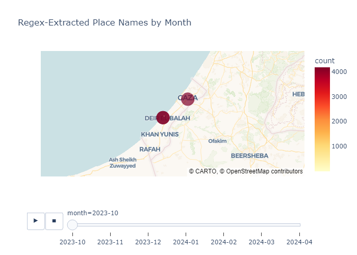
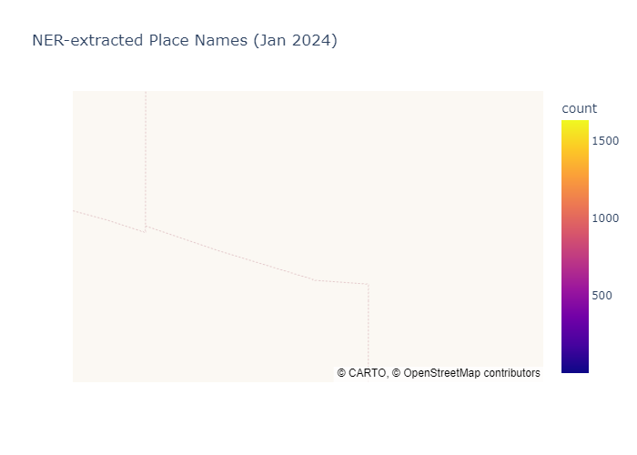

# FASDH25 MINI PROJECT NO.2 PORTFOLIO

# ABOUT THE PROJECT
This project is a part of our Digital Humanities Course. In this project, we explore how to visualize the places 
mentioned in news articles over time. Using computational tools, we identify toponyms (place names) in each article 
through two methods: regular expressions combined with a gazetteer, and Named Entity Recognition (NER), a Natural 
Language Processing (NLP) technique. Once the place names are extracted through NER, we geocode them to obtain their 
latitude and longitude coordinates. Finally, we visualize the data on a map to observe how the geographic scope of 
the news shifts over time. 

# DATA USED FOR THE PROJECT 
The dataset used in this project is a collection of 4,341 news articles about the Gaza war, sourced from the Al Jazeera 
English website and compiled by Inacio Vieira. It is publicly available on Kaggle [insert link here]. Although the dataset 
is titled to reflect coverage of the Gaza War starting in November 2023, it also includes articles published before that date. 
For our regex and gazetteer-based extraction and mapping, we focus only on articles published after the start of the current 
conflict (post-October 7, 2023), as our aim is to explore how the geographic focus of news coverage has shifted since the war 
began. For the Named Entity Recognition (NER) part of the project, we use a subset of articles published in January 2024, 
following the project instructions.

# FOLDER STRUCTURE OF THE REPOSITORY
The root folder of our project contains three main folders: articles, which holds the collection of news articles used for analysis; 
gazetteer, which contains lists of places along with their coordinates and metadata for the Gaza project, including geonames_gaza_selection—
a curated set of Gaza-related places from the GeoNames website and countries.tsv, which provides a coordinate pair for each country in the world. 
The third folder is scripts, which includes various Python scripts such as build_gazetteer, Gaza_NER2_yasir_afreen_bushra, regex_script_final, 
yasir_afreen_bushra_NER_mapping_script, and yasir_afreen_bushra_regex_mapping_script, as well as two subfolders: data, which contains three TSV files 
(regex_counts, ner_counts, and NER_gazetteer) that are outputs generated by the scripts, and outputs, which contains the HTML and PNG map visualizations 
created from the data in the data folder. In addition to these folders, the root directory also contains a Word document titled AI documentation, which 
compiles all coding solutions and guidance obtained through ChatGPT, and a README file that provides an overview of the project.

# DESCRIPTION ABOUT WHAT INDIVIDUAL SCRIPT AND COLLAB NOTEBOOK DOES
## 1. regex_script_final
In this script, we apply regular expressions and a gazetteer to a dataset of 4341 Al Jazeera English articles about the Gaza war, collected by Inacio Vieira. 
Although the dataset includes older articles, we use a condition to skip those published before the current war (starting November 2023), as our focus is on 
mapping how the geographic focus of news articles has shifted since the start of the ongoing conflict in Gaza. In our earlier classes, we used only the first 
column (“asciiname”) of the gazetteer to identify a place in a text. We noticed that this did not catch all mentions of the place in an article because of spelling 
differences and alternate names — in computer science language: the recall was low. To improve this, we adapted in this script we build a regular expression for 
each row in the gazetteer that matches not only the asciiname but also any of the alternative names listed in the other columns. This makes the script better at 
identifying place names from the gazetteer in the text and improves overall recall. The output of this script is saved in the form of a TSV file named regex_counts 
containing three columns: placename, month, and count, which we have stored in our data folder which we will further use for mapping.
## 2. Gaza_NER2_yasir_afreen_bushra
In this Colab notebook, we use Named Entity Recognition (NER), a Natural Language Processing (NLP) technique, to identify place names in a dataset of 4341 Al Jazeera 
English articles about the Gaza war, compiled by Inacio Vieira. While the dataset contains articles from various dates, we apply a filter to include only those published 
in January 2024, as instructed, focusing specifically on extracting place names from that month. To improve the accuracy and consistency of the place names, we also perform 
cleaning through the process of normalization, which we learned in class. This step ensures that variations in place name formats or spellings are standardized for better
matching. The output, containing the identified and cleaned place names, is saved in the form of a TSV file called ner_counts conataining two columns named pplacename and 
count, which we store in the data folder within the script directory for further use and analysis.
## 3. build_gazetteer
In the notebook titled Gaza_NER2_yasir_afreen_bushra, which is a part of our Mini Project No. 2 portfolio, we applied Named Entity Recognition (NER), a Natural Language 
Processing (NLP) technique, to identify place names in a dataset of 4341 Al Jazeera English articles about the Gaza war, compiled by Inacio Vieira. Although the dataset 
includes articles from various dates, we applied a filter to include only those published in January 2024, as instructed. Our focus was to extract place names specifically 
from that month.We stored the places we found using NER in a TSV file named ner_counts.tsv, which is also part of our Mini Project No. 2 portfolio. Now, in this Colab notebook,
we will apply geocoding to find coordinates for those places and save them in a TSV file named NER_Gazetteer.tsv, which we will later use for mapping purposes.
## 4.yasir_afreen_bushra_NER_mapping_script
In this script, we use the output generated from the Gaza_NER2_yasir_afreen_bushra collab notebook (a .tsv file containing the monthly count of places)
and the NER_gazetteer from the build_gazetteer collab notebook of our mini project No. 2. We merge these files because the NER_counts
file does not contain coordinates, which are essential for mapping, while the NER_gazetteer file provides the geographic
coordinates for these places. By merging the datasets, we combine the place counts with their respective geographic coordinates, enabling us to map the locations 
using Panda and Plotly express.
## 5. yasir_afreen_bushra_regex_mapping_script
In this script, we use the output generated from the regex_script_final file (a .tsv file containing the monthly count of places)
and the geoname_gaza_selections file from the gazetteer folder of our mini project No. 2. We merge these files because the regex_counts
file does not contain coordinates, which are essential for mapping, while the geoname_gaza_selections file provides the geographic
coordinates for these places. By merging the datasets, we combine the place counts with their respective geographic coordinates, enabling 
us to map the locations using Panda and Plotly express.

# ADVANTAGES AND DISADVANTAGES OF THE TECHNIQUES WE USED IN THIS PROJECT 
In this project, we used two primary techniques to extract place names from a large collection of news articles: one based on regular expressions and a gazetteer, and the 
other using Named Entity Recognition (NER), a Natural Language Processing (NLP) method. While both approaches helped us identify geographic locations mentioned in the text, 
each had its own set of advantages and limitations, which became especially clear during our sanity checks and data validation processes.

The regex and gazetteer-based method was straightforward in its logic—it matched place names from the text against those listed in our gazetteer. However, this method had 
significant limitations. One major issue was inconsistency in recognizing different versions of the same place. For example, *Jabalia* and *Jabalya* refer to the same location, 
with one being the ASCII name and the other an alternate spelling, yet the output gave them separate counts. Similarly, *An Nusayrat* and *Nuseirat*, which are also the same place, 
were treated as different entries. Another example was *Bureij* and *Al Bureij*, which had separate counts despite referring to the same location. Even worse, we encountered completely 
unrelated matches—for instance, *Qizan* was counted separately even though it's not listed as an alternate name for *Qizan An Najjar*. These issues highlight a key weakness in the 
regex-gazetteer approach: it relies too heavily on exact or near-exact string matches and does not automatically group alternate or misspelled versions of the same place, which can lead to 
inflated or fragmented counts for single locations.

On the other hand, the NER technique presented a different set of challenges. It was more dynamic in recognizing place names across different spellings and contexts, but it often produced 
noisy output that required intensive cleaning. For instance, differences in punctuation (like a comma or period after a place name) caused separate counts. Acronyms and full names of places 
(e.g., *USA* vs *United States*) were counted separately, and the presence of articles like "the" or capitalization differences (e.g., *The Netherlands* vs *Netherlands*) also affected the 
output. As a result, we had to normalize the data through text cleaning steps we learned in class, such as removing articles, standardizing spelling, and merging variations. Even after cleaning, 
inconsistencies remained, particularly when multiple places were mentioned close together—for example, *Israel Goren* was misread as one place, affecting count accuracy. Furthermore, the geocoding
process sometimes failed to find coordinates for less common place names, requiring us to manually look them up using Google. Another drawback was the NER model's tendency to misclassify personal 
names as locations; for example, names like *Netanyahu* and *Carogennez* were incorrectly labeled as places and had to be manually removed from the dataset.

In summary, while the regex-gazetteer method provided a more structured approach and was relatively easier to trace, it lacked flexibility and failed to consolidate alternate names effectively. 
The NER approach offered more nuanced place recognition but demanded extensive post-processing and cleaning to correct for errors and misclassifications. Both techniques had value in this project,
but each also presented critical limitations that need to be addressed in future applications, especially when dealing with sensitive topics and multilingual datasets.

## Places in the NER gazetteer for which we manually entered latitude and longitude
Dahiyeh 
Nairoukh 
Shawawra 
Shujayea 
Alsaftawi 
Almahatta 
Alwalaja 
Altanf 
Alaqsa 
Alkarama 
Almawasi 
Almughraqa 
Almaghazi 
Beruit 
Almazraa 
Pashias 
Almazraa Asharqiya 
Altawil 
Alkhader 
Aljiftlik 
Sistanbaluchestan 
Rmeish 
Margaliot 
Mazzeh 
Alshifa 
Bosniaherzegovina 

#  IMAGES OF OUR FINAL MAPS
## MAP GENERATED FROM REGEX COUNTS TSV FILE AND GEONAMES GAZETTER FILE

## MAP GENERATED FROM NER COUNTS TSV FILE AND NER GAZETTEER TSV FILE

# COMPARISON OF THE JANUARY 2024 MAPS GENERATED FROM THE REGEX AND NER DATA
For the Regex map, we created an animated map based on months, and both maps are similar because they were both created as geo-scatter plots with hover functionality displaying counts, 
longitude, and latitude. However, the maps also differ in several ways. For the Regex map of Gaza, the hover shows a count of 1956, which is higher compared to the NER map, where the 
count is 1623. This suggests that the Regex method has extracted more place mentions for Gaza than the NER approach. Additionally, the Regex map only shows places in Gaza, while the 
NER map displays data for the whole globe. When we hover over other locations in the NER map, we observe that Israel and Gaza have the highest counts, whereas other places across the 
globe have much lower counts. This shows that journalists focused heavily on Israel and Gaza, while news from the rest of the world was relatively underrepresented. This also reflects 
media behavior, where coverage often prioritizes sensational or high-impact events. In the NER map, we also notice that the Red Sea appears incorrectly located in America, possibly due 
to geocoding errors. Furthermore, in the NER script, the count for Israel is 1632, slightly higher than Gaza’s 1623. This could indicate that more reports were coming from Israel, where 
journalists had greater access, compared to Gaza, where restrictions might have limited coverage. While we cannot make a conclusive claim, this raises an interesting research question 
about media access, narrative framing, and the global distribution of news attention.

# WEAKNESSES IN THE PROJECT AND IMPROVEMENTS NEEDED
## 1. Inconsistencies in the Regex and Gazetteer Output:
One major issue we faced was that it counted different versions of the same place separately. For example, Jabalia and Jabalya are the same place (Jabalia is the ASCII name, Jabalya is 
the alternate name) but the counts were different. Same happened with An Nusayrat and Nuseirat, and also with Bureij and Al Bureij. Even worse, it counted Qizan separately even though it 
is not an alternate of Qizan An Najjar. This shows that the regex-gazetteer technique relied too much on exact or near-exact matches, and didn’t recognize different names for the same place 
which made our output fragmented. If we had more time, we could have figured out a better way to group these places properly.
## 2. Improvements in the NER Script:
Even after we did cleaning and normalization, there were still issues. For example, Israel Goren was counted as one place just because two places were written together. Also, Gaza and Gazas 
still showed different counts after cleaning. Some places didn’t geocode properly either—like Red Sea appeared in America on the map. We had to manually search coordinates for some places. 
If we had more time, we could have double-checked coordinates and added extra layers of cleaning to improve accuracy.
## 3. GitHub Issues: 
Some group members faced problems in committing after forking the repo. We tried fixing it, sometimes it worked, sometimes it didn’t. So, Yasir had to commit most of the changes, which is 
why you’ll see more commits from his GitHub and fewer from Afreen and Bushra. If we had more time we could have figured what might be the issue be.
## 4. Project Management:
Trello crashed multiple times, and we were logged out while checking the comments where group members had tagged us. We think it might be because a lot of people were using Trello close to 
the deadline. Even though before deadlines it was also happening. In future, it would be better if we could use another project management tool like Notion which few of group members have already 
used.
## 5. Colab: 
We faced issues with T4-GPU usage limits on Colab. Once our quota finished, the notebook took forever to run, and we couldn’t install Stanza on our laptops. If we had more time, we could have 
looked for lighter tools that work better on limited resources.

